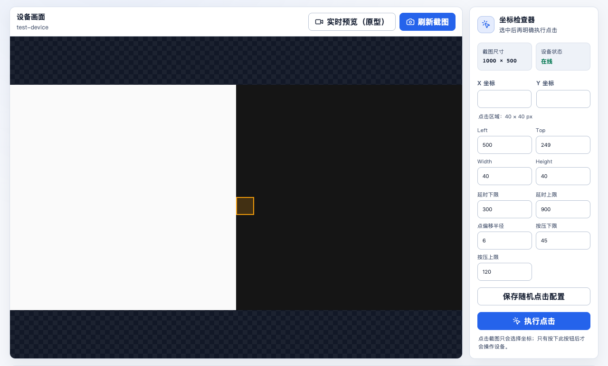
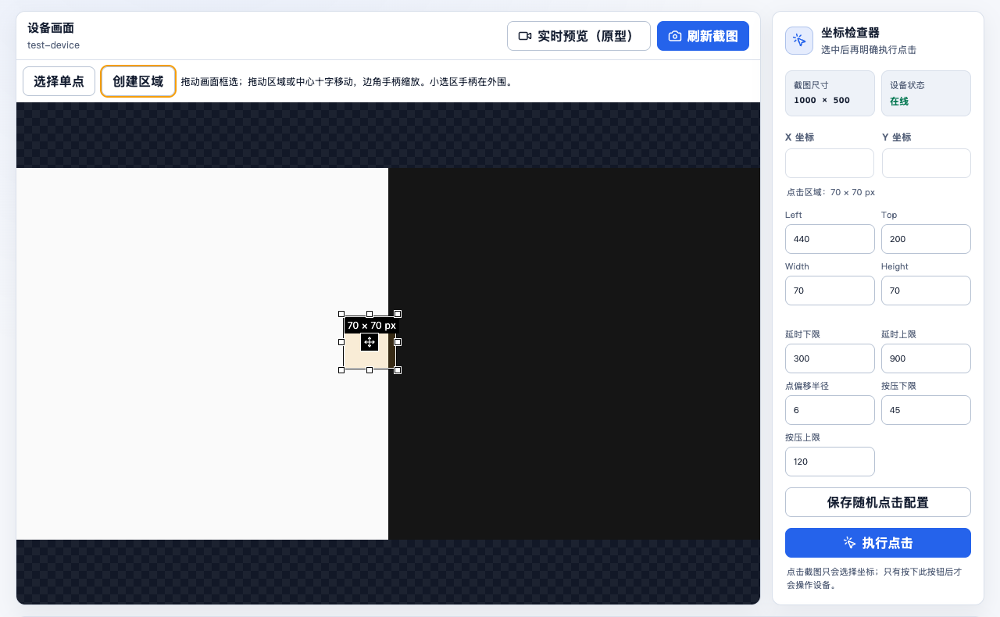
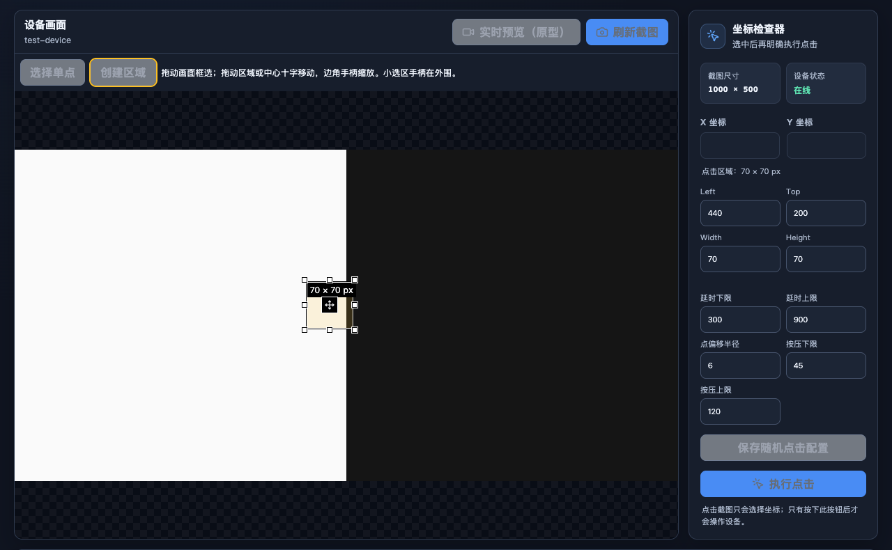

# Issue #24 验证记录

日期：2026-09-13。审查基准：`b40208cbb95c2851ce1d29150ce580a8cde25d9d`。规格：[GitHub Issue #24](https://github.com/Bald-M/OnmyojiSupportTools/issues/24)。

本次实现鼠标创建、移动、八方向缩放，保留原有矩形 IPC 契约。设备输入和校准仍通过现有 DeviceManager 命令完成。自动检查在 macOS 和原生 Windows x64 CI 通过；浏览器交互证据来自 macOS Chromium。**实际 Windows Tauri/WebView2 交互验收尚未完成**。

## 自动化证据

| 验收要求 | 证据与结果 |
| --- | --- |
| 无数字输入创建、移动、放大/缩小 | App 交互测试及真实 Chromium mouse QA 通过。八方向手柄逐一命中并调整区域。 |
| 缩放、留白、各方向坐标映射 | coordinates 四向反向拖拽及留白测试；App 0.5 缩放留白测试通过。真实浏览器等长屏幕拖拽得到等长原始像素尺寸，创建期间画面布局不变。 |
| 边界内、至少 1 像素、移动保持尺寸 | App 边缘缩小和单像素创建测试通过；浏览器画面外释放后坐标等于画面尺寸减区域尺寸，移动前后宽高一致。 |
| 松开后的 click 保留矩形 | App 包含 pointerdown → mousedown → pointermove → pointerup → mouseup → click；浏览器使用真实 mouse 序列，矩形保留。 |
| 画面外释放与取消结束编辑 | 浏览器在 stage 外释放并继续移动，目标不变；App pointercancel 之后可开始新编辑。 |
| 编辑不发送手动设备输入 | App 与浏览器 QA 的 tap 调用次数均为 0；现有“执行点击”测试验证显式提交点/矩形。 |
| 随机点击与所有校准入口复用 | App 测试验证矩形 tap IPC；六态识别/动作、弹窗特征与关闭区域均使用相同矩形。 |
| 刷新截图、停止预览、设备变化清理 | App 测试验证清除选区，拖拽结束事件不会恢复旧目标；ADB 切换与预览失效也进入同一清理入口。 |
| 数字同步与小选区手柄 | App 验证数字字段与覆盖层同步、立即限制非法值；浏览器实际命中测试证明小选区的八个 24px 手柄及中心移动控件互不重叠。原始像素边界由独立覆盖层显示。 |
| 文档与完整检查 | README、CHANGELOG 与 Windows 验收矩阵已更新。`pnpm check`、`pnpm frontend:build` 通过。 |
| Windows x64 构建与交互 | `pnpm build:windows:x64` 的 macOS 交叉构建及原生 Windows x64 CI 均通过；实际 Tauri/WebView2 交互仍待验收。 |

最终 `pnpm check`：8 个构建脚本测试、35 个前端测试、43 个 Rust 测试通过；1 个 Rust 子进程辅助测试按项目既有方式忽略，由父测试启动。类型检查、ESLint、Rust fmt/clippy 通过。

Windows 产物：`dist/OnmyojiSupportTools_0.1.0_windows_x64_nsis-setup.exe`。macOS 构建日志有交叉编译签名限制及 MSVC PDB 相关既有警告，原生 CI 结果独立记录如下。

## 原生 Windows CI

[CI run 34732873992](https://github.com/Bald-M/OnmyojiSupportTools/actions/runs/34732873992) 已完成，结论 `success`，检查提交 `dac50270fe6021518cb305f80a8032955b5161fd`：

- `Quality · Windows x64`：`pnpm check` 与 `pnpm frontend:build` 通过，35 个前端测试和 43 个 Rust 测试通过。
- `Build · Windows x64`：原生 `pnpm build:windows:x64` 通过，日志确认 `platform=windows architecture=x64 target=x86_64-pc-windows-msvc`；NSIS 产物上传成功。
- `pr-title`：workflow_dispatch 没有 PR，按工作流条件跳过。

已下载原生 CI 产物并替换本机 `dist/` 中的交叉构建安装包。`dist/` 仅保留 `OnmyojiSupportTools_0.1.0_windows_x64_nsis-setup.exe`，大小 5,625,030 字节，SHA-256：`7c41b8ae986d363ed9675be23d5ec1e6376a39a117a76a2b0c32509fbb93e806`。

此 CI 证明原生构建和自动检查；没有执行 Tauri/WebView2 鼠标交互验收。

## 可重放的真实浏览器 QA

[qa-region-editor.mjs](../../../scripts/qa-region-editor.mjs) 直接用 Vite 内存编译 App，替换设备适配器为合成黑白截图，并通过 `file://` 加载；不启动 HTTP 服务、不调用 ADB、不使用游戏或个人数据。Playwright 是可选的外部 QA 工具，不加入应用依赖。

```shell
node scripts/qa-region-editor.mjs /absolute/path/to/playwright/index.mjs /absolute/path/to/chromium
node scripts/qa-region-editor.mjs /absolute/path/to/playwright/index.mjs /absolute/path/to/chromium --before
```

本次使用 Chrome `153.0.8010.36`、1280 × 1000 窗口运行成功。第二条命令对固定基准生成旧版截图；第一条重新生成当前浅色和深色截图。浏览器测试覆盖实际命中，组件测试验证各方向对应的具体像素结果。二者均不能证明 Windows WebView2 行为。

## 界面证据

均为合成画面和虚构设备标识。

修改前：



修改后：



深色模式：



## 两轴审查

Standards：0 项违规，0 项待修复代码异味。

Spec：初审发现小区域手柄覆盖移动入口及缺少实际命中测试，均已修复；复审未发现新的可修复实现问题。原生 Windows 构建与自动检查已完成；实际 Tauri/WebView2 交互要求仍未完成。

## 待完成

按 [Windows 验收矩阵](../../windows-acceptance.md#鼠标区域编辑issue-24) 在原生 Windows x64 + Tauri/WebView2 窗口执行 Issue #24 项目，记录 Windows/WebView2/模拟器版本及结果。构建项已由原生 CI 完成；不得将 macOS Chromium 或 CI 构建结果填写为 Windows WebView2 交互通过。
